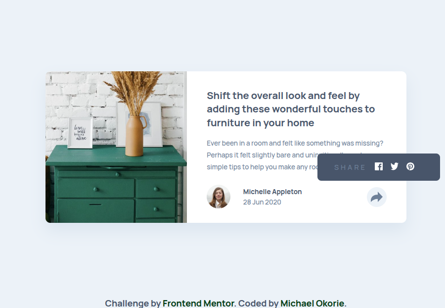

# Article Preview Component Solution

This is my solution to the [Article Preview Component Challenge](https://www.frontendmentor.io/challenges/article-preview-component-dYBN_pYFT) on [Frontend Mentor](https://www.frontendmentor.io/). It's a great exercise to sharpen responsive layout skills and work with subtle UI/UX interactions like toggling visibility and positioning elements conditionally.

---

## 📚 Table of Contents

- [Overview](#-overview)
  - [The Challenge](#-the-challenge)
  - [Screenshot](#-screenshot)
  - [Links](#-links)
- [My Process](#-my-process)
  - [Built With](#-built-with)
  - [What I Learned](#-what-i-learned)
  - [Continued Development](#-continued-development)
  - [Useful Resources](#-useful-resources)
- [Author](#-author)
- [Acknowledgments](#-acknowledgments)

---

## Overview

### The Challenge

Users should be able to:

- ✅ View the optimal layout for the component depending on their device's screen size
- ✅ Toggle social media share options by clicking the share icon

### 🖼️Screenshot



### 🔗 Links

- **Solution**: [View my code on GitHub](https://github.com/Michael-Okorie/Article-Preview-Component.git)
- **Live Site**: [Check it out live](https://michael-okorie.github.io/Article-Preview-Component/)

---

## My Process

### Built With

- **Semantic HTML5**
- **CSS Custom Properties**
- **Flexbox** & **Grid**
- **Mobile-First Workflow**
- **JavaScript DOM Manipulation**

### What I Learned

This project helped me solidify my understanding of positioning logic, especially how to:

- Position elements **relative to containers** based on media queries
- Toggle visibility of elements cleanly using **JavaScript and CSS classes**
- Use **responsive units** to ensure clean layouts across mobile and desktop

#### Sample Code Snippet

```js
shareIcon.addEventListener('click', () => {
  icons.classList.toggle('shareActive');
});

```
---

### Continued Development

- I’d like to refine the **accessibility** aspect of this component using `aria-labels`.
- Also considering adding **transitions** for a smoother icon reveal.
- Will revisit with a **React version** soon to practice **state handling** and improve component reusability.

---

### Useful Resources

- 📘 [MDN Web Docs - Positioning](https://developer.mozilla.org/en-US/docs/Web/CSS/position)
- 📚 [CSS Tricks - Flexbox Guide](https://css-tricks.com/snippets/css/a-guide-to-flexbox/)
- 💬 [Frontend Mentor - Article Discussions](https://www.frontendmentor.io/solutions)

---

### Author

- **Github** – [Michael-Okorie](https://github.com/Michael-Okorie)
- **Frontend Mentor** – [@Michael Okorie](https://www.frontendmentor.io/profile/Michael-Okorie)
- **Twitter** – [@Dev_Michael_](https://x.com/Dev_Michael_)

---

### Acknowledgments

Big thanks to:

- The **Frontend Mentor** community for the helpful feedback and code inspiration.
- [**Kevin Powell**](https://www.youtube.com/kepowob) for his CSS tips that helped improve my layout thinking.
- **You**, the reader! 👀 If you’ve come this far, feel free to **fork this repo** or leave a ⭐ to show some love!


